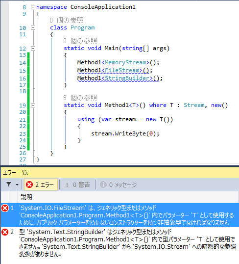

## もし C# で形式的検証ができたら

C# では、コンパイル時に静的にコードをチェックし、警告やエラーを通知してくれます。
例えば、次のようなものです。




1 つ目の例はステートメントの条件分岐により、そのスコープに到達できるかどうかを判定しています。
実行はでき、致命的ではないので、エラーではなく警告が通知されています。
2 つ目の例の where 句では、ジェネリック型に対する制約が指定されています。

現時点のコンパイラもそれなりに強力な判断能力を持っているとは思いますが、
**もし C# のコンパイラがさらに空気を読んで賢くなったら、**
どのようなプログラミング エクスペリエンスを実現できるのかを考えてみましょう。

実装のお題として「与えられた 2 つの整数を昇順に並べ替えるメソッド」という単純なものを設定し、
どうすればバグのないプログラミングができるかを考えます。

まず、並べ替えのメソッドが満たすべき条件は次の通りです。

1. 実行結果が意図した順番に並んでいる
1. 実行前の値のセットと実行後の値のセットが同じである

そこで、メソッドの実装を始める前に、メソッドのシグネチャでこれらの条件を表現してみます。

```c#:Program.cs
/* 
 * このプログラムには、架空の機能が含まれます。
 */
using System;

namespace SortConsole
{
    class Program
    {
        static void Main(string[] args)
        {
            var sorted = Sort(new TwoValues(2, 1));
        }

        // Point: 引数に対する高度な制約。
        static OrderedTwoValues Sort(TwoValues v) where Sort(v).SetEquals(v)
        {
            // TODO: Implementation.
            throw new NotImplementedException();
        }
    }

    // null を代入できない型。
    public class TwoValues where this != null
    {
        public int X { get; private set; }
        public int Y { get; private set; }

        public TwoValues(int x, int y)
        {
            X = x;
            Y = y;
        }

        public bool SetEquals(TwoValues v)
        {
            return X == v.X ? Y == v.Y
                : X == v.Y && Y == v.X;
        }
    }

    public class OrderedTwoValues : TwoValues
    {
        // Point: 引数に対する高度な制約。
        public OrderedTwoValues(int x, int y)
            : base(x, y) where x <= y
        {
        }
    }
}
```

int[] や List&lt;int&gt; の代わりに、TwoValues クラスを定義して 2 つの整数を表現しています。
TwoValues クラスを継承して、順序を保持する OrderedTwoValues クラスを定義します。
このコンストラクターにある「`where x <= y`」は、
静的チェックのレベルで引数が x ≦ y を満たした状態でコンストラクターを呼び出さなければ、
コンパイルがエラーとなることを意味します。

そして、並べ替えを表す Sort メソッドの引数を TwoValues 型、戻り値を OrderedTwoValues 型とします。
これにより、条件 1 が保証されます。

さらに、Sort メソッドに対する制約として「`where Sort(v).SetEquals(v)`」を追加します。
SetEquals メソッドは [ISet&lt;T&gt;.SetEquals メソッド](http://msdn.microsoft.com/ja-jp/library/dd412096.aspx)と同様、集合として等しいかどうかを判定します。
これにより、条件 2 が保証されます。

これで、メソッドのシグネチャだけで条件 1, 2 を表現できました。
ということは、コンパイルが成功するように実装するだけで、バグが存在しないことが保証されます。
(上記の段階では NotImplementedException が発生するため、条件 2 を満たさず、コンパイルはエラーとなります。)

では、いよいよ実装です。といってもこれだけですが。

```c#
static OrderedTwoValues Sort(TwoValues v) where Sort(v).SetEquals(v)
{
    // Point: 変数の大小関係などの高度なコンテキスト。
    return v.X <= v.Y
        ? new OrderedTwoValues(v.X, v.Y)
        : new OrderedTwoValues(v.Y, v.X);
}
```

`new OrderedTwoValues(v.X, v.Y)` の部分は `v.X <= v.Y` を満たすスコープの中にいるため、大小関係の制約を満たします。
同様に、`new OrderedTwoValues(v.Y, v.X)` の部分は `v.Y < v.X` を満たすスコープの中にいるため、大小関係の制約を満たします。
ここで渡す引数を逆にしてしまうと、コンパイル エラーとなります。

また、コンストラクターの引数には `v.X` および `v.Y` を一度ずつ渡しているため、メソッドの引数と戻り値は集合として等しくなります。
ここで例えば `return new OrderedTwoValues(0, 1)` などとしてしまうと、コンパイル エラーとなります。

具体的な数値を代入しなくても、変数のまま大小関係を保持することで、
コンパイラがこの程度の判断をすることは十分可能でしょう。
これは、人間が数学の証明をするときと同じレベルの判断です。

このような手法は形式的検証 (formal verification) と呼ばれ、バグが存在してはならないソフトウェアを作成するときに利用されます。

T.B.D.

#### 作成したサンプル
* [SortConsole](https://github.com/sakapon/Samples-2014/blob/master/VerificationSample/SortConsole/Program.cs) (GitHub)
* [MathConsole](https://github.com/sakapon/Samples-2014/blob/master/VerificationSample/MathConsole/Program.cs) (GitHub)

#### 参照
* [形式的検証 - Wikipedia](http://j.mp/e1FGFM)
* [プログラミング Coq](http://www.iij-ii.co.jp/lab/techdoc/coqt/)
* [証明駆動開発入門](http://www.iij-ii.co.jp/lab/techdoc/coqt/coqt8.html)
